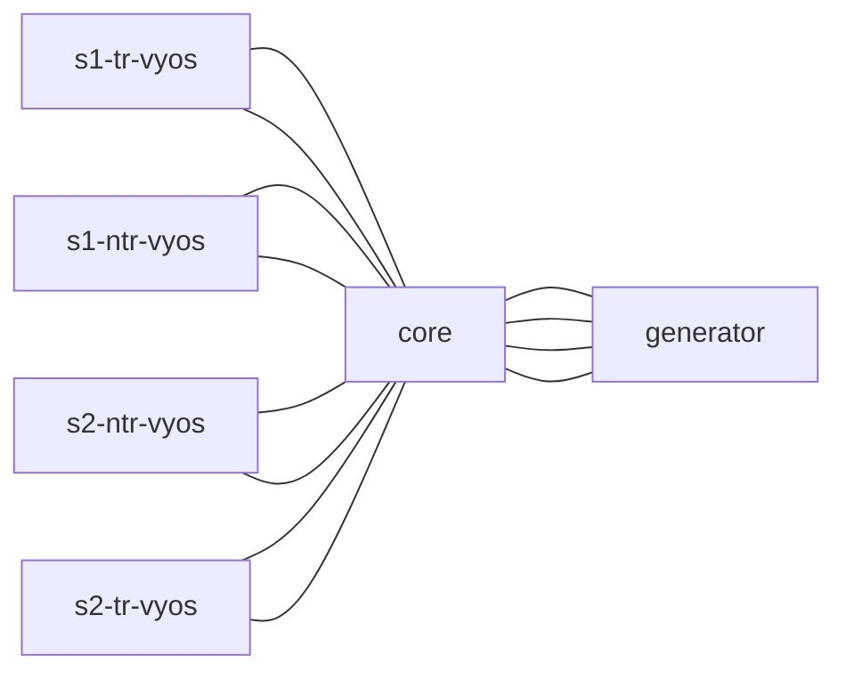

# Automation Workflow

1. **Desired State Definition**: Network configurations are defined as desired state files in the `data` repository. These files specify the configurations for L3 gateways, routing policies, and other network settings required by the NTE.

2. **Automation Execution**: When changes are pushed to `data` repository, a GitHub Actions pipeline is triggered. This pipeline executes Python scripts stored in `vyos` repository that leverage the Nornir library to parse the desired state files from `vyos`.

3. **Dynamic Configuration Application**: The Python scripts dynamically generate configuration commands based on the desired state definitions. Nornir then connects to the VyOS routers, applying the configurations as needed to achieve the defined states.

4. **Validation and Logging**: Post-configuration, the automation workflow includes steps for validating the applied configurations against the desired states. Any discrepancies are logged, and alerts are generated to notify the relevant teams for further investigation.

5. **Rollback and Recovery**: If any configuration changes fail, the automation workflow provides the ability to rollback to the previous state, ensuring a consistent environment after any failures.

6. **Documentation**: The automation workflow is updating documentation to reflect the changes. Documentation is stored on the `data` wiki repository.

## Automation testing

The integration of Containerlab with Virtual Vyatta routers offers a streamlined and efficient method for deploying and managing network environments. This approach combines the lightweight, flexible nature of container technology with the robust routing capabilities of Vyatta, facilitated by an automation and desired state deployment framework. This design enables rapid provisioning, testing, and deployment of complex network topologies.

Virtual Vyatta routers, running within Containerlab-managed containers, serve as the primary routing backbone of the network. These virtual routers offer advanced routing, firewall, and VPN functionalities, enabling a wide range of network configurations and scenarios to be tested and deployed.

### Containerlab definition



All infrastructure was defined within a file:

```yaml
name: nte
mgmt:
  bridge: br-oob
  ipv4-subnet: 172.100.200.0/24
  ipv4-gw: 172.100.200.1
  ipv6-subnet: 2001:192:168:2::/80
  ipv6-gw: 2001:192:168:2::1

topology:
  nodes:
    # site 1
    s1-tr-vyos:
      kind: linux
      image: muruu1/vyos
      cmd: /sbin/init
      binds:
        - /lib/modules:/lib/modules
        - configs/s1-tr-vyos:/opt/vyatta/etc/config
      mgmt-ipv4: 172.100.200.240
      # startup-config: configs/s1-tr-vyos/config.boot
    s1-ntr-vyos:
      kind: linux
      image: muruu1/vyos
      cmd: /sbin/init
      binds:
        - /lib/modules:/lib/modules
        - configs/s1-ntr-vyos:/opt/vyatta/etc/config
      mgmt-ipv4: 172.100.200.241
      # startup-config: configs/s1-ntr-vyos/config.boot
    # site 2
    s2-tr-vyos:
      kind: linux
      image: muruu1/vyos
      cmd: /sbin/init
      binds:
        - /lib/modules:/lib/modules
        - configs/s2-tr-vyos:/opt/vyatta/etc/config
      mgmt-ipv4: 172.100.200.245
      # startup-config: configs/s2-tr-vyos/config.boot
    s2-ntr-vyos:
      kind: linux
      image: muruu1/vyos
      cmd: /sbin/init
      binds:
        - /lib/modules:/lib/modules
        - configs/s2-ntr-vyos:/opt/vyatta/etc/config
      mgmt-ipv4: 172.100.200.246
      # startup-config: configs/s2-ntr-vyos/config.boot
    #  core / ixn
    core:
      kind: cisco_n9kv
      image: vrnetlab/vr-n9kv:9.3.9
      mgmt-ipv4: 172.100.200.250
      startup-config: configs/core.cfg
      env:
        QEMU_MEMORY: 6144 # N9kv-lite requires minimum 6GB memory
        QEMU_SMP: 2 # N9kv-lite requires minimum 2 CPUs
    # Test servers
    generator:
      kind: keysight_ixia-c-one
      image: ghcr.io/open-traffic-generator/ixia-c-one:1.14.0-1
      mgmt-ipv4: 172.100.200.249
  links:
    # site 1
    - endpoints: ["s1-tr-vyos:eth1", "core:Ethernet1/1"]
    - endpoints: ["s1-ntr-vyos:eth1", "core:Ethernet1/2"]
    - endpoints: ["s1-tr-vyos:eth2", "core:Ethernet1/11"]
    - endpoints: ["s1-ntr-vyos:eth2", "core:Ethernet1/12"]
   # site 2
    - endpoints: ["s2-tr-vyos:eth1", "core:Ethernet1/3"]
    - endpoints: ["s2-ntr-vyos:eth1", "core:Ethernet1/4"]
    - endpoints: ["s2-tr-vyos:eth2", "core:Ethernet1/13"]
    - endpoints: ["s2-ntr-vyos:eth2", "core:Ethernet1/14"]
    # Traffic generator
    - endpoints: ["generator:eth1", "core:Ethernet1/20"]
    - endpoints: ["generator:eth2", "core:Ethernet1/21"]
    - endpoints: ["generator:eth3", "core:Ethernet1/22"]
    - endpoints: ["generator:eth4", "core:Ethernet1/23"]
```

### Containerlab deployment

After successful deployment definition, the network topology can be deployed using command:

```bash
sudo containerlab deploy -t nte.clab.yml
```

### Automation testing

The automation testing is done by emulating github action pipeline.

1. Clone desired state file repository.
2. Indide of the `data` folder clone `vyos` repository.
3. Create python virtual environment and install requirements.
4. Update `hosts.yaml` file to reflect you test deployment.

   ```yaml
    ---
    s1-ntr-vyos:
    hostname: 172.100.200.241
    groups:
        - e1
        - vyos
    s1-tr-vyos:
    hostname: 172.100.200.240
    groups:
        - e1
        - vyos
    s2-ntr-vyos:
    hostname: 172.100.200.246
    groups:
        - e2
        - vyos
    s2-tr-vyos:
    hostname: 172.100.200.245
    groups:
        - e2
        - vyos
   ```

5. Update `groups.yaml`file to set common parameters.

    ```yaml
    ---
    e1:
    data:
        ntp_servers:
        - 10.252.1.1
        - 10.252.1.2
        site: s1
    e2:
    data:
        ntp_servers:
        - 10.252.2.1
        - 10.252.2.2
        site: s2
    vyos:
    port: 22
    platform: vyos
    ```

6. Set environment variable for credentials.

    ```bash
    export VYOS_USERNAME=vyosuser # dafaults to vyos
    export VYOS_PASSWORD=vyos
    ```

7. Run test deployment.
   - change desired state files to reflect your test configuration.
   - execute script by running

        ```bash
        poetry run -P dr-vyos-code sync -i ./inventory.yaml -v
        ```

8. Login to the devices to validate deployment or perform tests using generator instance.

## References

- [Vyos documentation](https://www.vyos.io/)
- [Containerlab](https://containerlab.dev/)
- [Containerized vyos](https://github.com/containers/vyos)
